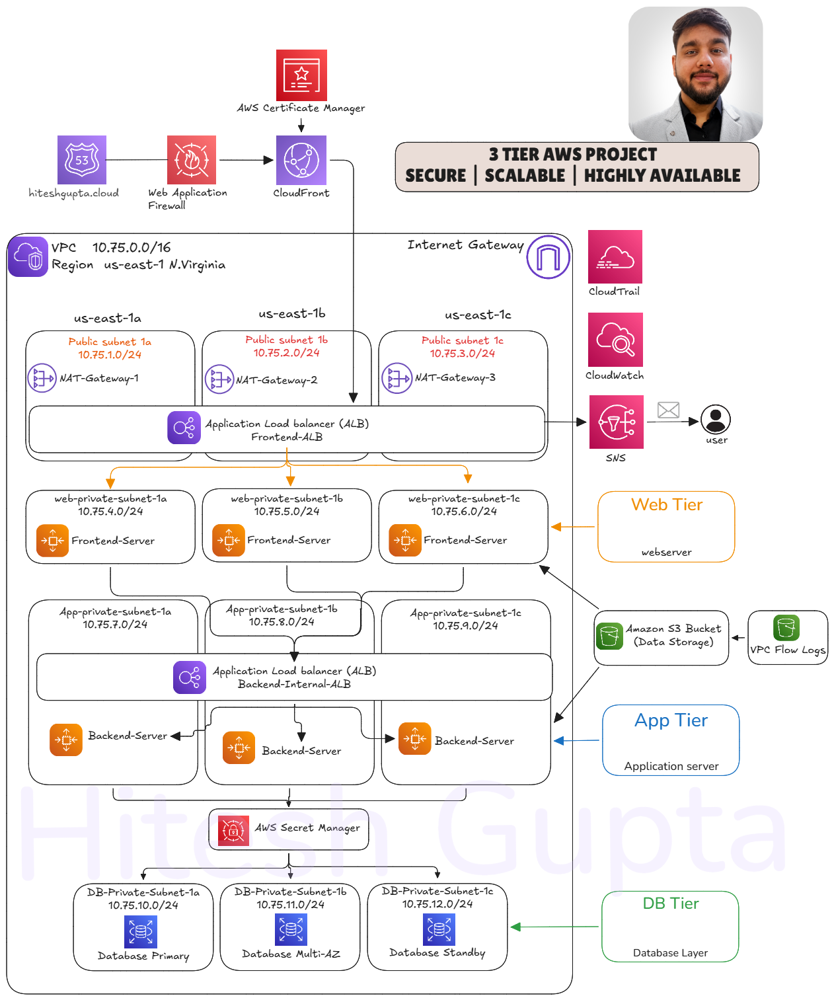

# AWS Three Tier Web Architecture Workshop

---
## Project Overview

This project demonstrates deployment of a production-grade 3-tier architecture on AWS using 15+ AWS services.

The architecture follows:
- Web Tier (Frontend React + Nginx)
- App Tier (Node.js Backend API)
- Database Tier (Amazon RDS MySQL)

The project focuses on:
- High Availability
- Security Best Practices
- Scalability with Auto Scaling
- Monitoring and Logging
- CDN and Web Security


## AWS Services Used

- Amazon VPC
- Security Group (Cross-connection)
- EC2
- Auto Scaling Group
- Application Load Balancer
- Amazon RDS
- Amazon S3 (Data + VPC Flow Logs)
- IAM
- AWS Secrets Manager
- CloudWatch
- CloudTrail
- Amazon SNS
- Route 53
- CloudFront
- AWS WAF
- AWS Certificate Manager (ACM)

## Security Implementation

- Multi-tier private subnet architecture
- Security Group based cross-tier communication
- IAM Roles attached to EC2 instead of access keys
- Secrets stored in AWS Secrets Manager
- Database deployed in private subnet
- AWS WAF for Layer 7 protection
- CloudTrail enabled for account activity monitoring
- VPC Flow Logs stored in S3
- ACM SSL certificate for HTTPS encryption


---

## Create a Security Group

| SG name      | inbound        | Access         | Description                                  |
|--------------|----------------|---------------|----------------------------------------------|
| Jump Server  | 22             | MY-ip         | access from my laptop                        |
| 1. web-frontend-alb     | 80,         | 0.0.0.0/24    | all access from internet                     |
| 2. Web-srv-sg      | 80,  22    | 1. web-frontend-alb       | only front-alb and jump server access        |
|              |                | jump-server   |                                              |
| 3. app-Internal-alb-sg     |  80,  | 2. Web-srv-sg      | only web-srv                                 |
| 4. app-Srv-sg      | 4000,  22 | 3. app-Internal-alb-sg | only 3. app-Internal-alb-sg and jump server access          |
|              |                | jump-server   |                                              |
| 5. DB-srv       | 3306, 22       | 4. app-Srv-sg       | only app-srv and jump server access          |
|              |      3306          | jump-server   |                                              |

---

## Create a VPC

| #  | Component         | Name                  | CIDR / Details                                |
|----|-------------------|-----------------------|-----------------------------------------------|
| 1  | VPC              | 3-tier-vpc            | 10.75.0.0/16                                  |
| 12 | Subnets          | Public-Subnet-1a      | 10.75.1.0/24                                  |
|    |                  | Public-Subnet-1b      | 10.75.2.0/24                                  |
|    |                  | Public-Subnet-1c      | 10.75.3.0/24                                  |
|    |                  | Web-Private-Subnet-1a | 10.75.4.0/24                                  |
|    |                  | Web-Private-Subnet-1b | 10.75.5.0/24                                  |
|    |                  | Web-Private-Subnet-1c | 10.75.6.0/24                                  |
|    |                  | App-Private-Subnet-1a | 10.75.7.0/24                                  |
|    |                  | App-Private-Subnet-1b | 10.75.8.0/24                                  |
|    |                  | App-Private-Subnet-1c | 10.75.9.0/24                                  |
|    |                  | DB-Private-Subnet-1a  | 10.75.10.0/24                                 |
|    |                  | DB-Private-Subnet-1b  | 10.75.11.0/24                                 |
|    |                  | DB-Private-Subnet-1c  | 10.75.12.0/24                                 |

| #   | Component         | Name/Route Table                | CIDR/Details      | NAT Gateway | Notes                                         |
|-----|-------------------|---------------------------------|-------------------|-------------|-----------------------------------------------|
| 1   | Internet Gateway  | 3-tier-igw                      |                   |             |                                               |
| 3   | Nat gateway       | 3-tier-1a                       |                   |             |                                               |
|     |                   | 3-tier-1b                       |                   |             |                                               |
|     |                   | 3-tier-1c                       |                   |             |                                               |
| 10  | Route-Table       | 3-tier-Public-rt                |                   |             |                                               |
|     |                   | 3-tier-web-Private-rt-1a        | 10.75.4.0/24      | nat-1a      |                                               |
|     |                   | 3-tier-web-Private-rt-1b        | 10.75.5.0/24      | nat-1b      |                                               |
|     |                   | 3-tier-web-Private-rt-1c        | 10.75.6.0/24      | nat-1c      |                                               |
|     |                   | 3-tier-app-Private-rt-1a        | 10.75.7.0/24      | nat-1a      |                                               |
|     |                   | 3-tier-app-Private-rt-1b        | 10.75.8.0/24      | nat-1b      |                                               |
|     |                   | 3-tier-app-Private-rt-1c        | 10.75.9.0/24      | nat-1c      |                                               |
|     |                   | 3-tier-db-Private-rt-1a         | 10.75.10.0/24     | nat-1a      |                                               |
|     |                   | 3-tier-db-Private-rt-1b         | 10.75.11.0/24     | nat-1b      |                                               |
|     |                   | 3-tier-db-Private-rt-1c         | 10.75.12.0/24     | nat-1c      |                                               |
 
---

## Setup the Ec2-instance and create the IAM (WEB Tier)
**REF:** [web-tier](https://github.com/hiteshgupta1751/3-tier-aws-15-services/edit/main/application-code/web-tier)

**Only Setup the Packages:**  
- Nginx  
- nvm  

---

## Setup the Ec2-instance and create the IAM (APP Tier)
**REF:** [app-tier](https://github.com/hiteshgupta1751/3-tier-aws-15-services/tree/main/application-code/app-tier)

**Only Setup the Packages:**  
- install  
    - mysql client  
    - nvm  
    - pm2  

---

## Create images for both web and app Tier
- Web-Tier-IAM-IMAGE  
- APP-Tier-IAM-IMAGE  


## Create a Cloud-Trail
- Name: my-aws-Account-Activity

---

## Create the  S3 Buckets

```bash
git clone https://github.com/hiteshgupta1751/3-tier-aws-15-services.git
```

1. 3-tier-aws-project-8745 (upload your content)  
2. 3tier-vpc-flow-log-8745 (attach this bucket this immediately) with arn Value [ arn:aws:s3:::3tier-vpc-flow-log-8745 ]

---

## Create a Mysql in the RDS

### First Create the subnet Group

| Name    | three-subnet-gp-rds   |
|---------|-----------------------|
| VPC     | three-tier-rds-subnetgroup            |
| AZ      | 1a, b, c              |
| Subnets | DB-Private-Subnet-1a  |
|         | DB-Private-Subnet-1b  |
|         | DB-Private-Subnet-1c  |

| Parameter                          | Value                |
|-------------------------------------|----------------------|
| DB instance identifier              | db-3tier             |
| Master username                     | admin                |
| Self managed password               | SuperadminPassword   |
| Instance class (Burstable)          | db.t3.small          |
| Storage                            | 20 GB                |
| Virtual private cloud VPC           | 3-tier-vpc           |
| Security Group (SG)                 | db-srv               |
| Enable Enhanced monitoring          | Unchecked            |
---

### Move on to the Secret manager

Other type of secret:

```
DB_HOST = your rds Endpoint
DB_USER = admin
DB_PWD =  SuperadminPassword
DB_DATABASE = webappdb
```
- Secret name: rds-mysql-secret

---

## Now add the Database into the RDS-MYSQL

Run this command from APP-tier server

```bash
mysql -h CHANGE-TO-YOUR-RDS-ENDPOINT -u admin -p
```

```sql
CREATE DATABASE webappdb;
SHOW DATABASES;
USE webappdb;
CREATE TABLE IF NOT EXISTS transactions(id INT NOT NULL AUTO_INCREMENT, amount DECIMAL(10,2), description VARCHAR(100), PRIMARY KEY(id));
SHOW TABLES;
INSERT INTO transactions (amount,description) VALUES ('400','groceries');
SELECT * FROM transactions;
```

---

## Create SNS

- name: web-tier-sns  
- name: app-tier-sns  
- name: Cloudwatch-sns  

---

## Create a role for both web and app tier

- 3-tier-web-role:
    - AmazonS3ReadOnlyAccess
    - AmazonSSMManagedInstanceCore

- 3-tier-app-role:
    - AmazonS3ReadOnlyAccess
    - AmazonSSMManagedInstanceCore
    - SecretsManagerReadWrite

---

## Create web launch template

| Parameter              | Value                |
|------------------------|----------------------|
| Name                   | web-tier-lt          |
| My AMI's               | Web-Tier-IAM-IMAGE   |
| Security Groups        | Web-srv-sg           |
| IAM Instance Profile   | 3-tier-web-role      |

**User Data:**
```bash
#!/bin/bash
# Log everything to /var/log/user-data.log
exec > >(tee /var/log/user-data.log|logger -t user-data -s 2>/dev/console) 2>&1

# Install AWS CLI v2 (if not already)
yum install -y awscli

# Download application code from S3
aws s3 cp s3://<YOUR-S3-BUCKET-NAME>/application-code /home/ec2-user/application-code --recursive

# Go to app directory
cd /home/ec2-user/application-code

# Make script executable and run it
chmod +x web.sh
sed -i 's/\r$//' web.sh
sudo ./web.sh
```

---

## Create app launch template

| Parameter              | Value                |
|------------------------|----------------------|
| Name                   | app-tier-lt          |
| My AMI's               | app-Tier-IAM-IMAGE   |
| Security Groups        | app-Srv-sg           |
| IAM Instance Profile   | 3-tier-web-role      |

**User Data:**
```bash
#!/bin/bash
# Log everything to /var/log/user-data.log
exec > >(tee /var/log/user-data.log|logger -t user-data -s 2>/dev/console) 2>&1

# Install AWS CLI v2 (if not already)
yum install -y awscli

# Download application code from S3
aws s3 cp s3://<YOUR-S3-BUCKET-NAME>/application-code /home/ec2-user/application-code --recursive

# Go to app directory
cd /home/ec2-user/application-code

# Make script executable and run it
chmod +x app.sh
sed -i 's/\r$//' app.sh
sudo ./app.sh
```

---

## Create target group 

| Tier      | Name      | Port  | VPC         | Health-check   |
|-----------|-----------|-------|-------------|---------------|
| Web Tier  | Web-tier  | 80    | 3-tier-vpc  |               |
| App Tier  | App-tier  | 4000  | 3-tier-vpc  | /health        |
---

## Create Load balancers

### Application Load Balancers
| Load Balancer | Name     | Type            | VPC        | Availability Zones                                 | Security Groups | Listeners & Routing   |
|---------------|----------|-----------------|------------|---------------------------------------------------|-----------------|----------------------|
| app-alb       | app-alb  | Internal-facing | 3-tier-vpc | App-Private-Subnet-1a, 1b, 1c                     | app-Internal-alb-sg         | 80 app-tier          |
| web-alb       | web-alb  | Internet-facing | 3-tier-vpc | Public-Subnet-1a, 1b, 1                           | web-frontend-alb        | 80 web-tier          |
---

## Immediately update the `nginx.config` of your internal load balancer Address
---
## Create Auto Scaling

| Name            | Launch template | Instance types | VPC        | Subnets (AZs)                       | Load balancer | Desired | min | max | Scaling policy | Notifications    | Tag      |
|-----------------|----------------|---------------|------------|--------------------------------------|---------------|---------|-----|-----|---------------|-----------------|----------|
| web-tier-asg    | web-tier-lb    | t2.micro      | 3-tier-vpc | Web-Private-Subnet-1a, 1b, 1c        | web-tier      | 3       | 3   | 6   | 60            | web-tier-sns    | web-asg  |
| app-tier-asg    | app-tier-lb    | t2.micro      | 3-tier-vpc | app-Private-Subnet-1a, 1b, 1c        | app-tier      | 3       | 3   | 6   | 60            | app-tier-sns    | app-asg  |

---

## Create the Cloudwatch 
- all alarms --> ec2 --> ASG --> Cpuutlization

---

## Create CloudFront Distribution  

1. Open **AWS Management Console** → Go to **CloudFront**  
2. Click **Create Distribution**  
3. Select the **Public Application Load Balancer DNS** as the **Origin Domain**  
4. Set **Viewer Protocol Policy** → Redirect HTTP to HTTPS  
5. Under **Cache Policy**, use default managed caching policy  
6. Enable **Compress Objects Automatically**  
7. Attach the **SSL Certificate (ACM)** once created  
8. Set **Default Root Object** → `index.html`  
9. Create the distribution and wait for deployment  

---

## Create ACM Certificate for HTTPS  

1. Go to **AWS Certificate Manager (ACM)**  
2. Switch region to **us-east-1** (required for CloudFront)  
3. Click **Request Certificate**  
4. Select **Request a public certificate**  
5. Enter your domain name  

   ```text
   hiteshgupta.cloud
   *.hiteshgupta.cloud
   ```

6. Choose **DNS Validation**  
7. ACM will generate **CNAME records**  
8. Add those records in **Route 53 Hosted Zone**  
9. Wait until certificate status changes to **Issued**  
10. Attach this certificate to CloudFront Distribution  

---

## Configure AWS WAF Protection  

1. Open **AWS WAF & Shield**  
2. Click **Create Web ACL**  
3. Choose resource type → **CloudFront Distribution**  
4. Select your CloudFront distribution  
5. Add AWS Managed Rule Groups  

   - AWSManagedRulesCommonRuleSet  
   - AWSManagedRulesKnownBadInputsRuleSet  
   - AWSManagedRulesAmazonIpReputationList  

6. Configure rate limiting rule to block excessive requests  
7. Set default action → **Allow**  
8. Review and create Web ACL  
9. Associate WAF with CloudFront Distribution  

---

## Configure Route 53 DNS  

1. Go to **Amazon Route 53**  
2. Create a **Hosted Zone** for your domain  

   ```text
   hiteshgupta.cloud
   ```

3. Update domain registrar nameservers with Route 53 nameservers  
4. Create **A Record (Alias Record)**  
5. Select target → **CloudFront Distribution**  
6. Configure root domain  

   ```text
   hiteshgupta.cloud
   ```

7. (Optional) Create subdomain record  

   ```text
   app.hiteshgupta.cloud
   ```

8. Save record configuration  
9. Test DNS resolution using  

   ```bash
   nslookup hiteshgupta.cloud
   ```

10. Access application over HTTPS  

   ```text
   https://hiteshgupta.cloud
   ```
